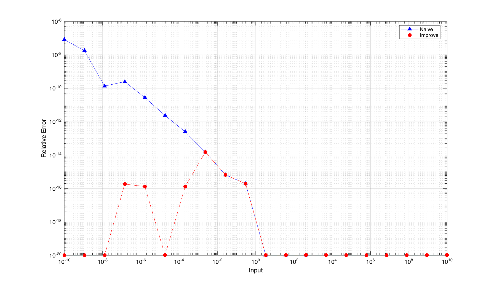

# Homework 1

### Problem 1
Test samples are generated by LLM (gemini).
```
GCD(54, 24) = 6
Divisibility test passed
GCD(105, 252) = 21
Coprimality test passed
GCD(21, 34) = 1
Fibonacci test passed
```

### Problem 2
```
input      | log_impl   | log_matlab | rel_err    | rt_err
0.0100     | -4.6052    | -4.6052    | 9.2e-07    | 9.158690e-09
0.0278     | -3.5818    | -3.5818    | 3.3e-07    | 9.105566e-09
0.0774     | -2.5584    | -2.5584    | 1.1e-07    | 8.746638e-09
0.2154     | -1.5351    | -1.5351    | 3.5e-08    | 7.504810e-09
0.5995     | -0.5117    | -0.5117    | 6.3e-09    | 3.778334e-09
1.6681     | 0.5117     | 0.5117     | 6.3e-09    | 1.051344e-08
4.6416     | 1.5351     | 1.5351     | 3.5e-08    | 1.616862e-07
12.9155    | 2.5584     | 2.5584     | 1.1e-07    | 1.459027e-06
35.9381    | 3.5818     | 3.5818     | 3.3e-07    | 1.176029e-05
100.0000   | 4.6052     | 4.6052     | 9.2e-07    | 9.158682e-05
All tests passed

10000.0000 | 9.2103     | 9.2103     | 8.9e-05    | 8.893457e-01
```
When the input is large (e.g., 10000), the relative error and round trip error both increases.

### Problem 3
```
input        | log_reduct | log_matlab | rel_err    | rt_err
0.0000       | -13.8155   | -13.8155   | 1.7e-09    | 1.715504e-15
0.0000       | -10.7454   | -10.7454   | 1.3e-08    | 2.801309e-13
0.0005       | -7.6753    | -7.6753    | 2.5e-09    | 1.174419e-12
0.0100       | -4.6052    | -4.6052    | 6.2e-09    | 6.243298e-11
0.2154       | -1.5351    | -1.5351    | 2.3e-09    | 5.037149e-10
4.6416       | 1.5351     | 1.5351     | 2.3e-09    | 1.085221e-08
100.0000     | 4.6052     | 4.6052     | 7.5e-09    | 7.529752e-07
2154.4347    | 7.6753     | 7.6753     | 2.5e-09    | 5.451171e-06
46415.8883   | 10.7454    | 10.7454    | 1.3e-08    | 6.035236e-04
1000000.0000 | 13.8155    | 13.8155    | 1.7e-09    | 1.715504e-03
All tests passed
```
This version handles larger (and smaller) inputs.

### Problem 4
