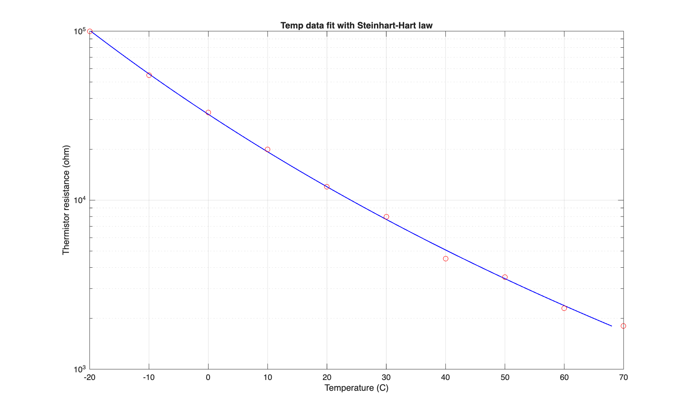
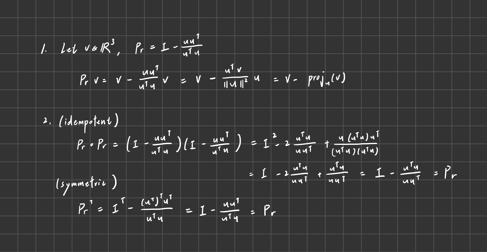
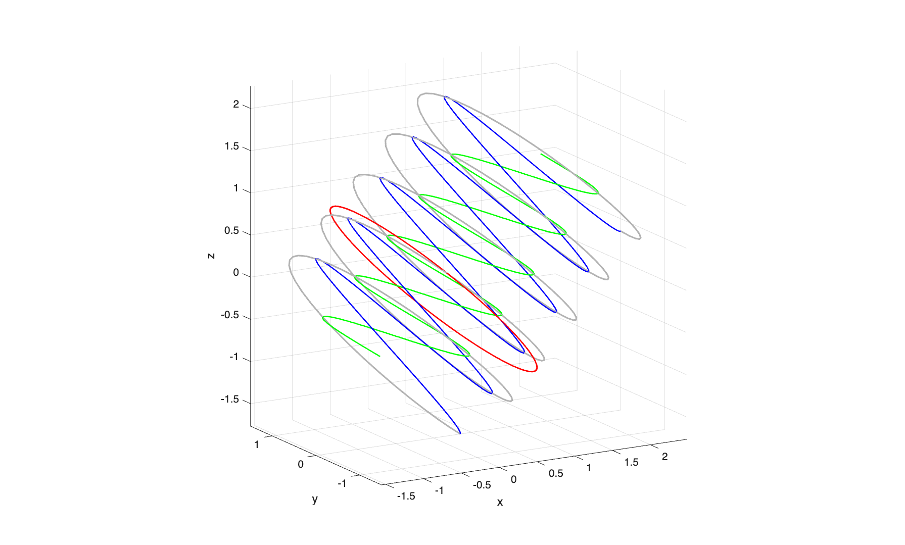
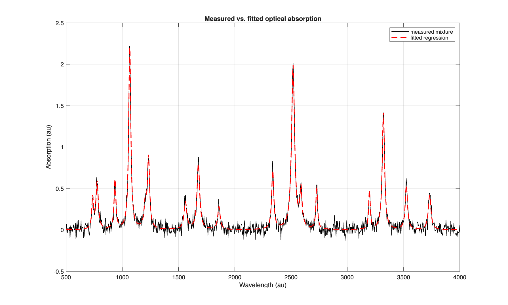

# Homework10

### Problem 1
```
Steinhart-Hart coefficients:
A = 1.034294e-03
B = 2.530881e-04
C = -5.028874e-10
```




### Problem 2



- $\hat{x}+\hat{z}$ is in red
- $-\hat{x}+\hat{z}$ is in green
- $\hat{y}$ is in blue




### Problem 3
```
methane: 51.97%
ethane:  16.94%
propane: 8.90%
nitrogen (inert): 22.20%
```

