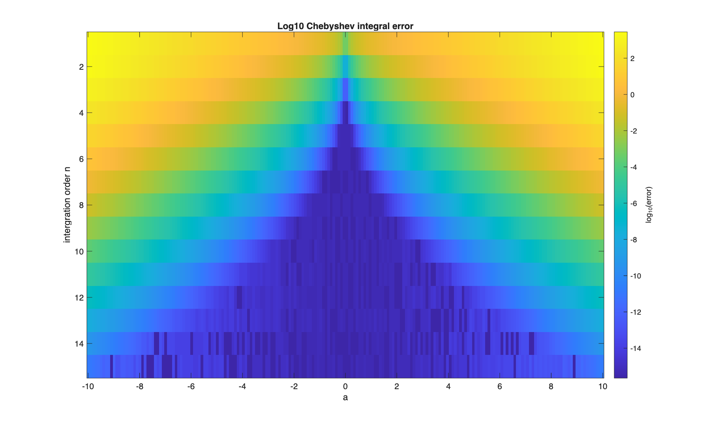
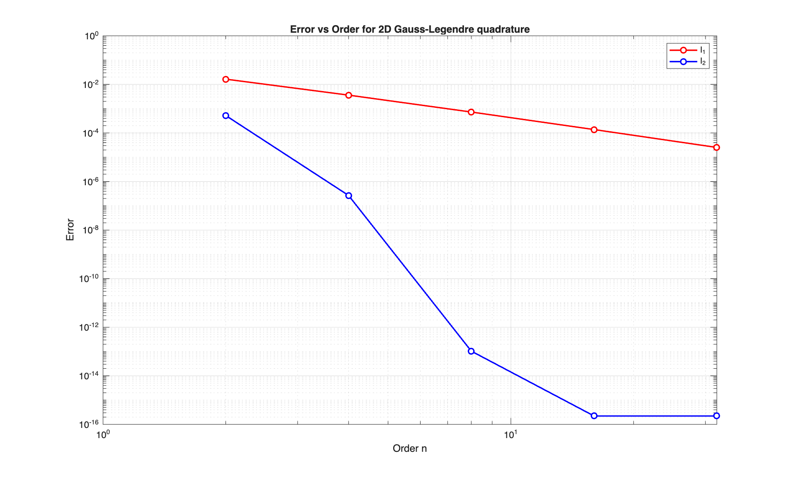
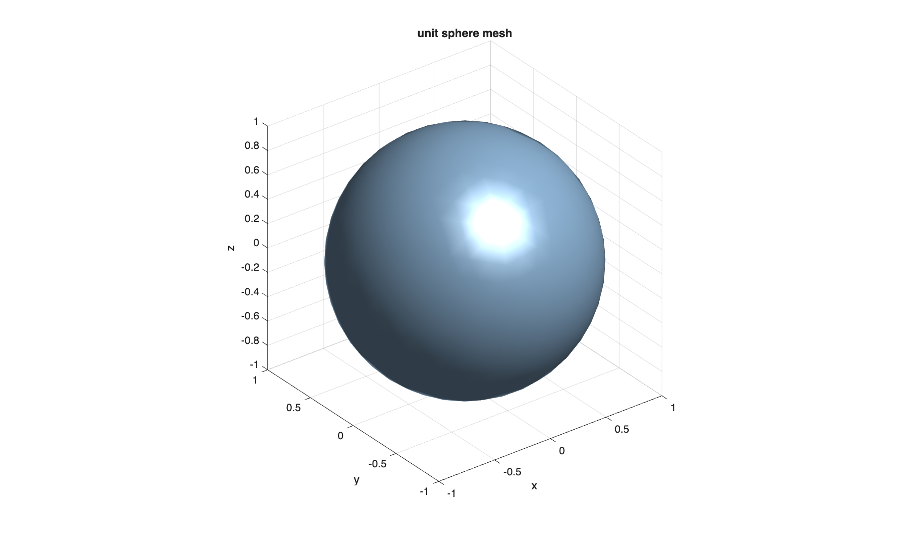
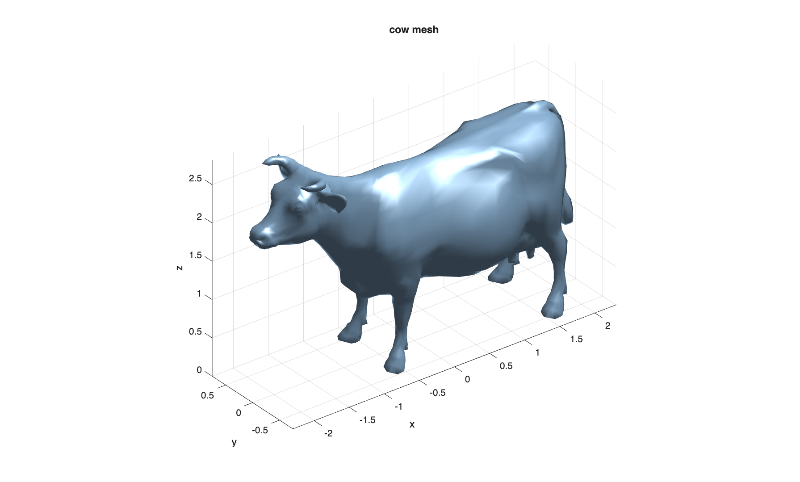

# Homework10

### Problem 1



### Problem 2

$$
I_1=\int^1_0\int^1_0(xy)^\frac{1}{4}\ dx\ dy=\left(\int^1_0x^\frac{1}{4}\ dx\right)^2=\left(\left[\frac{4}{5}x^\frac{5}{4}\right]^1_0\right)^2=\frac{16}{25}
$$



### Problem 3


```
unit sphere surface area: 12.5065
expected area (4*pi):     12.5664
error:                    0.48%
```

```
cow surface area:         21.1821
```