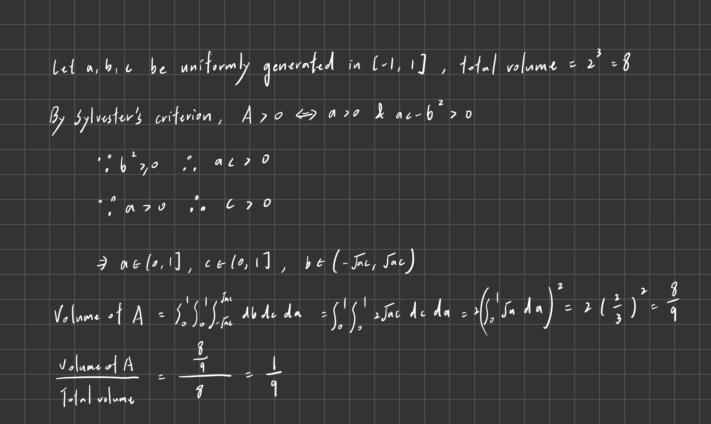
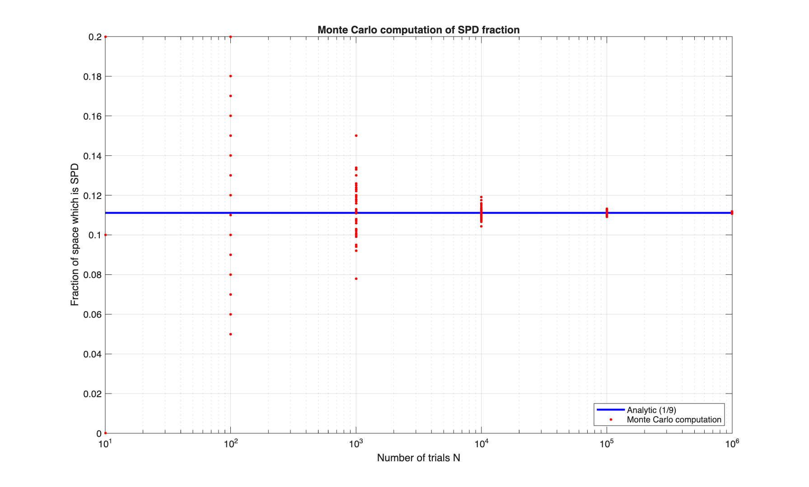
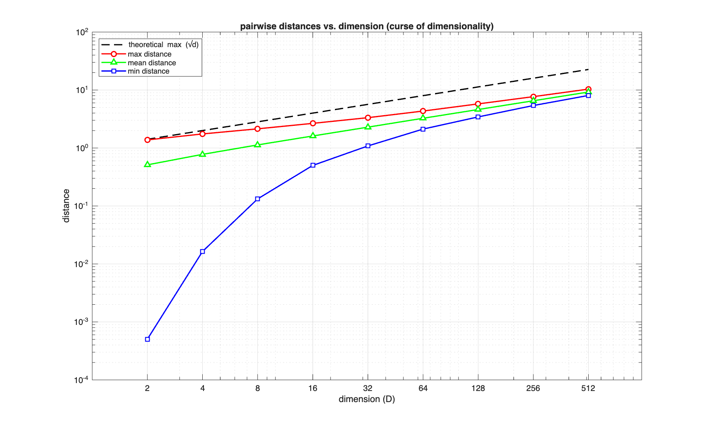

# Homework12

### Problem1
```
max error for z in [1.0, 10]: 1.329716e-03
max error for z in [0.1, 1.0]: 6.244578e+00
```
The error is much higher for $z < 1.0$ because the integrand $f(t) = t^(z-1)$ has a singularity at $t=0$, which ruins the polynomial approximation assumed by the gauss quadrature rule.


### Problem2

```
analytic fraction (1/9):        0.111111
monte carlo estimated fraction: 0.111099
absolute error:                 1.183111e-05
```



### Problem3

$$
\text{distance}=\sqrt{(1-0)^2+\dots+(1-0)^2}=\sqrt{D}
$$

