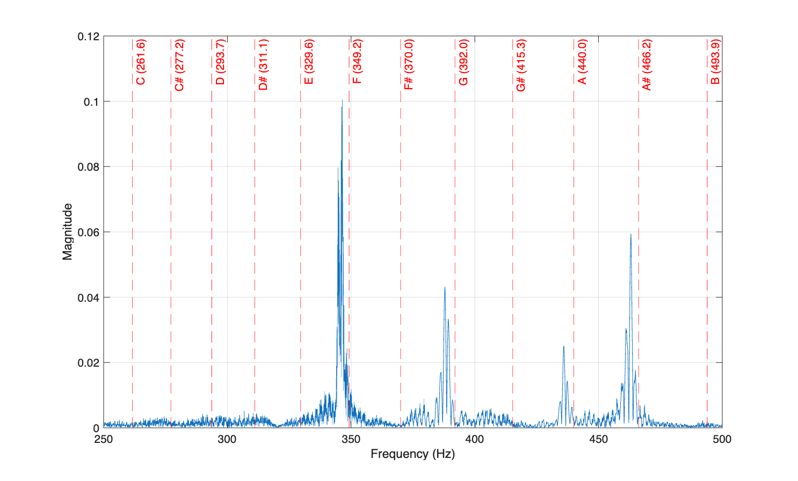
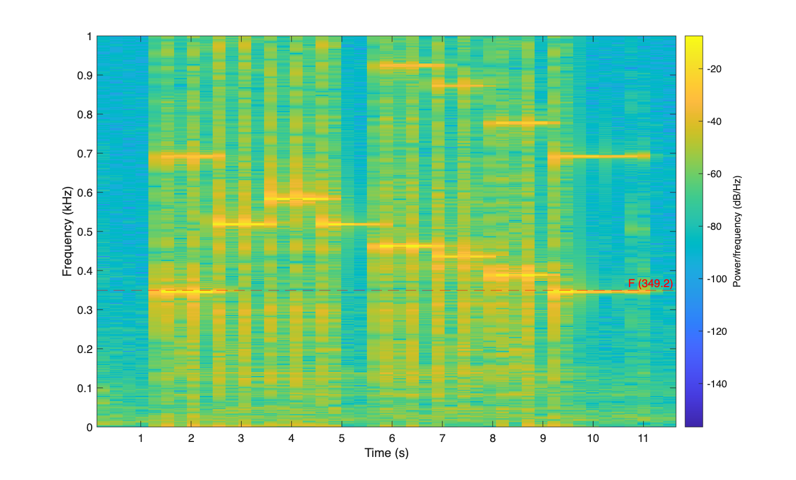
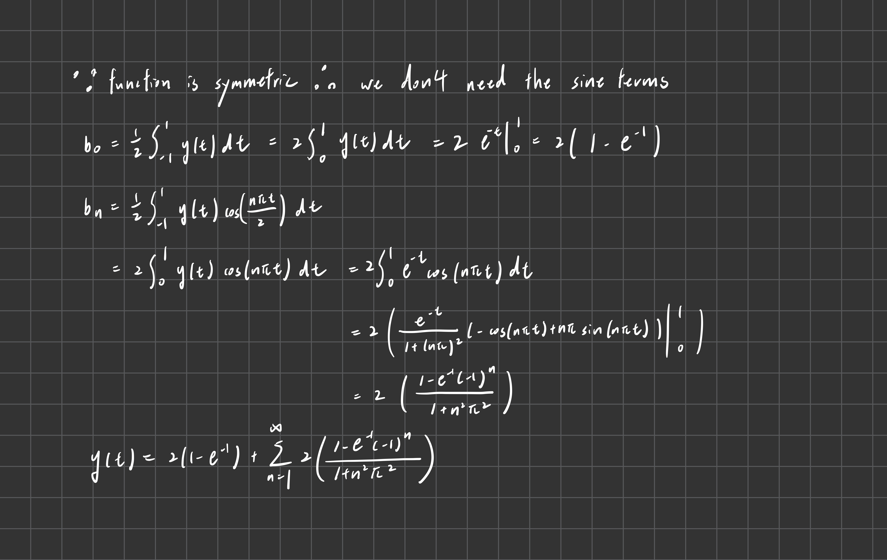
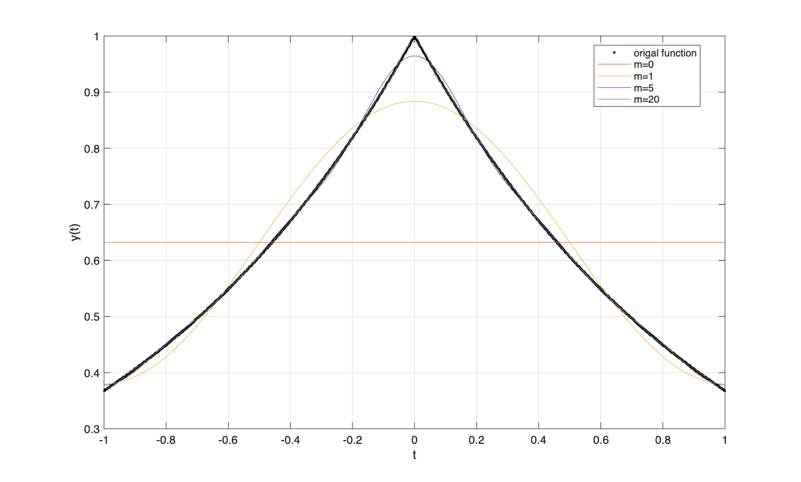
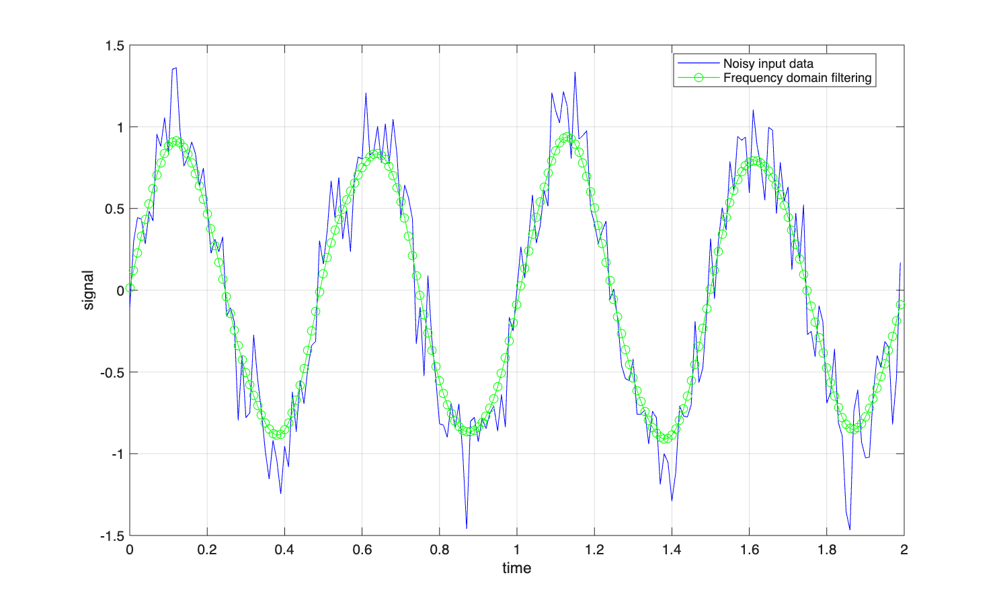

# Homework 2

### Problem 1

Detected note: F (loweset frequency).

Spectrogram also shows that the first/last note of *twinkle twinkle little star* is F note.
### Problem 2

We reproduce the series plot with different sum of terms.

We reproduce the error plot with different sum of terms.

### Problem 3
We reproduce the Gaussian filter with the same settings in the homework.
