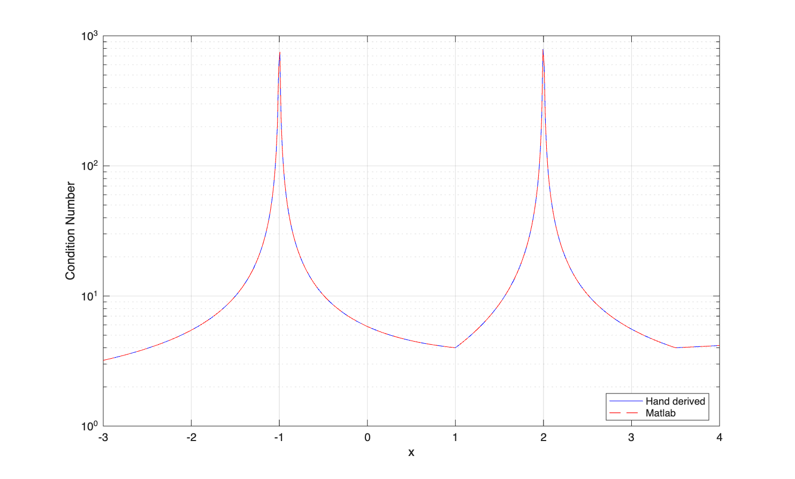
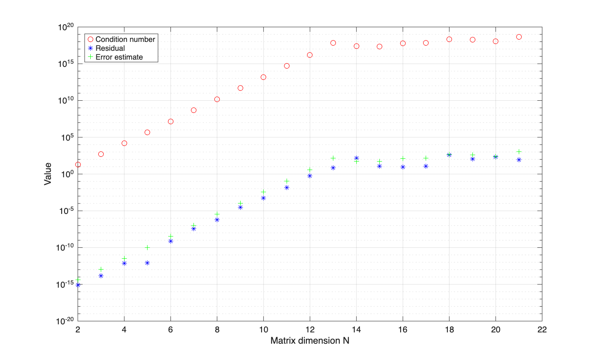

# Homework3

### Problem1


The plots overlap and matches our hand derived results.


### Problem2
We reproduce condition number, residual, and error plot. 


- The condition number is roughly 1e16 times larger then the error. This is because `eps` (roughly 1e-16) is the best precision we can get, and every order of magnitude of condition number increased, we lose the same amount of precision, which reflects in the error.
- The saturation for $N\geq13$ happens because the condition number for $N=13$ is near 1e16, and the double precision can not represent values closer to singularity.

### Problem3

```
Truck: 7 tons
  Beam   Force      Status         
  ----   -----      ------         
  1      -4.95      safe           
  2      3.50       safe           
  3      3.50       safe           
  4      -3.50      safe           
  5      -0.00      safe           
  6      3.50       safe           
  7      3.50       safe           
  8      4.95       safe           
  9      3.50       safe           
Bridge is safe with 7 ton truck.

Truck: 14 tons
  Beam   Force      Status         
  ----   -----      ------         
  1      -9.90      safe           
  2      7.00       tension fail   
  3      7.00       tension fail   
  4      -7.00      safe           
  5      -0.00      safe           
  6      7.00       safe           
  7      7.00       safe           
  8      9.90       tension fail   
  9      7.00       safe           
Bridge is not safe with 14 ton truck.
```