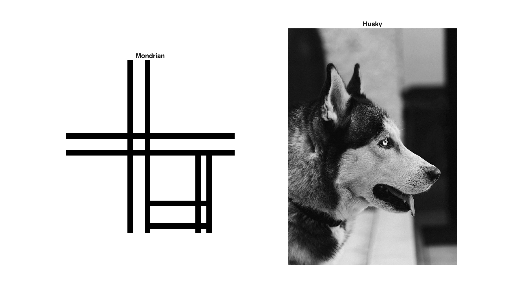
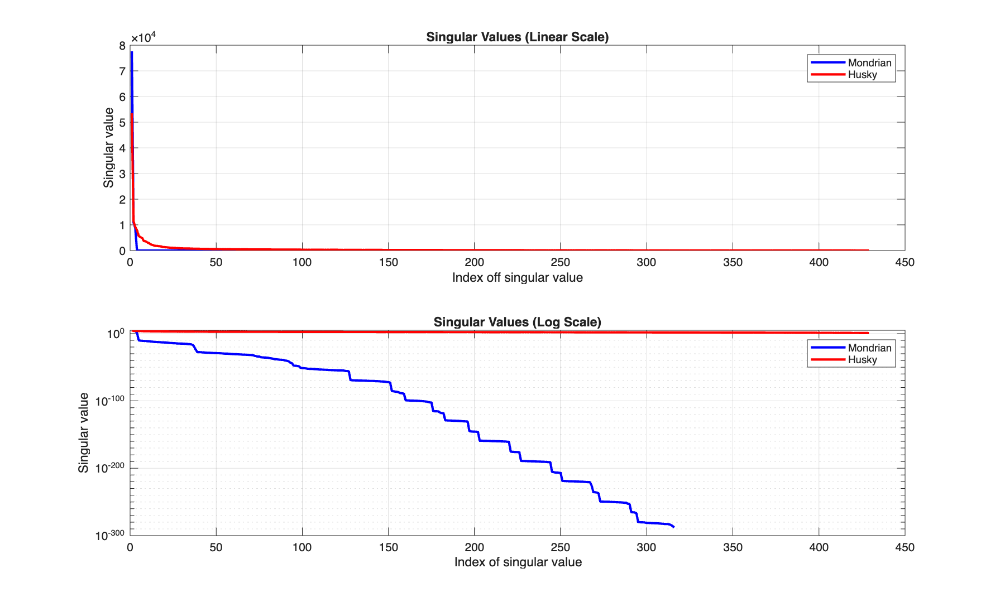
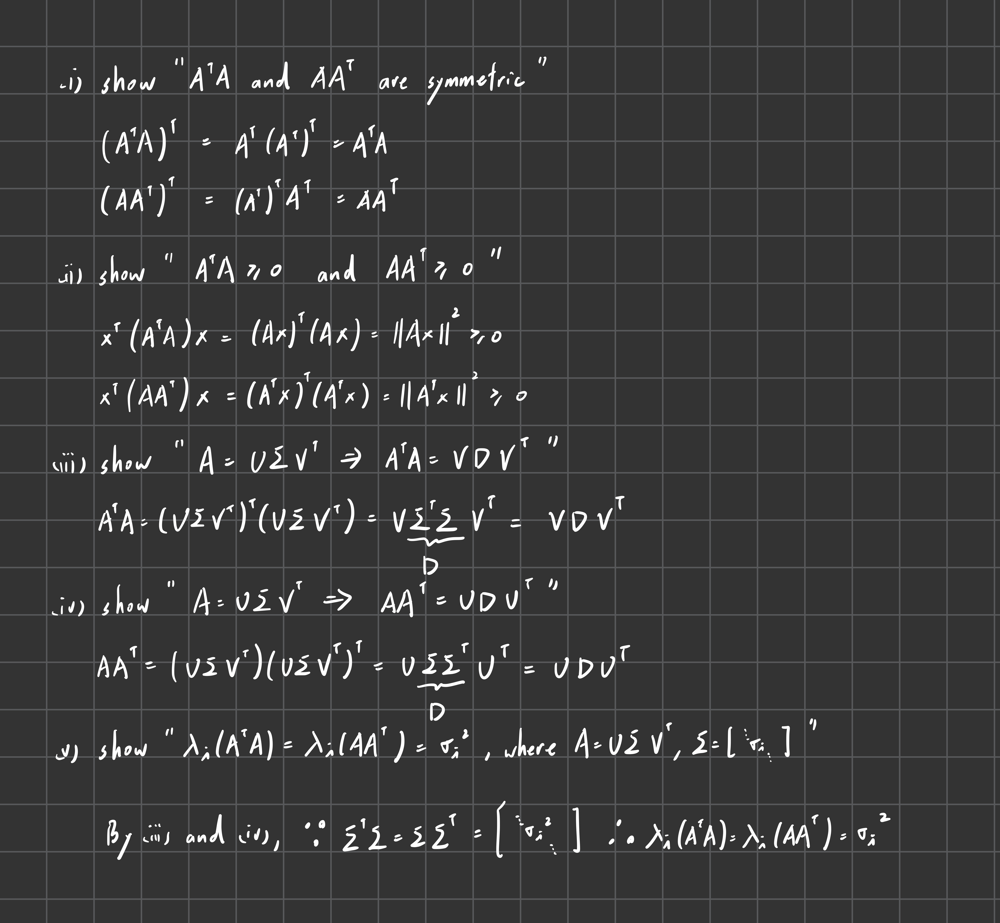

# Homework4

### Problem1



- The Mondrian matrix has 4 non-zero singular values, which is also the rank. This is because the image only have 4 linear independent columns (2 black rows, all black, 4 black rows, and 2 black rows with all black below the rows).
- The Husky matrix has 429 non-zero singular values, which is also the rank. Furthermore, it is full rank. This is because there is not linear independent columns/rows of the matrix.

### Problem2


We test 100 random matrices with all 5 assertions:
```
Size (N, M)  Status    
--------------------
(10, 24)     PASS      
(12, 25)     PASS      
(15, 15)     PASS      
( 6, 23)     PASS      
( 2,  8)     PASS      
(21,  6)     PASS      
( 4, 12)     PASS      
( 3,  7)     PASS      
(20,  5)     PASS      
( 9, 12)     PASS      
(22, 13)     PASS      
( 7, 24)     PASS      
(10, 12)     PASS      
(10,  2)     PASS      
(20,  5)     PASS      
(14,  8)     PASS      
(23, 20)     PASS      
( 4, 11)     PASS      
(24, 24)     PASS      
(18, 16)     PASS      
( 8,  2)     PASS      
(13, 20)     PASS      
( 9, 15)     PASS      
(22,  6)     PASS      
(15, 18)     PASS      
(11,  5)     PASS      
(23, 16)     PASS      
( 4,  9)     PASS      
(22, 10)     PASS      
( 7,  5)     PASS      
(25, 11)     PASS      
(18, 25)     PASS      
( 5, 20)     PASS      
(13, 13)     PASS      
( 6, 11)     PASS      
(12, 13)     PASS      
(18, 24)     PASS      
( 7, 21)     PASS      
(23, 23)     PASS      
( 6, 15)     PASS      
(16, 24)     PASS      
( 3, 23)     PASS      
(13, 11)     PASS      
( 2, 16)     PASS      
(21,  2)     PASS      
(16,  4)     PASS      
(23,  8)     PASS      
(11,  7)     PASS      
( 8, 12)     PASS      
(10, 11)     PASS      
(22, 24)     PASS      
( 2,  6)     PASS      
(14, 19)     PASS      
(10,  6)     PASS      
(21, 22)     PASS      
( 7, 18)     PASS      
(18, 13)     PASS      
(19,  3)     PASS      
( 2, 12)     PASS      
( 9, 19)     PASS      
( 3, 22)     PASS      
(23, 13)     PASS      
( 2, 22)     PASS      
(19, 13)     PASS      
(23, 19)     PASS      
( 7,  3)     PASS      
(20,  9)     PASS      
(11, 25)     PASS      
( 2, 14)     PASS      
(16, 23)     PASS      
(14,  4)     PASS      
(12, 17)     PASS      
(12, 10)     PASS      
(25, 17)     PASS      
( 8,  8)     PASS      
(13, 17)     PASS      
(15,  7)     PASS      
(22, 11)     PASS      
(20, 25)     PASS      
(20, 12)     PASS      
(14, 22)     PASS      
(17, 23)     PASS      
(23,  2)     PASS      
(17, 22)     PASS      
( 4,  6)     PASS      
(15, 21)     PASS      
(21,  2)     PASS      
(22, 23)     PASS      
(21,  9)     PASS      
( 5, 16)     PASS      
( 4, 19)     PASS      
(10,  4)     PASS      
(16, 25)     PASS      
( 5, 10)     PASS      
(10, 19)     PASS      
(16, 13)     PASS      
(10, 25)     PASS      
(25,  8)     PASS      
(24, 10)     PASS      
(13, 25)     PASS      
```

### Problem3
We test 100 random matrices and compute the residuals:
```
Size (N)   Residual        Tolerance       Status    
--------------------------------------------------
10         1.11e-15        4.89e-15        PASS      
17         9.03e-15        1.94e-14        PASS      
13         6.39e-16        7.11e-15        PASS      
18         8.09e-16        3.81e-15        PASS      
5          4.40e-15        1.21e-13        PASS      
21         3.31e-15        2.19e-14        PASS      
19         8.19e-16        1.58e-14        PASS      
19         2.83e-15        3.05e-14        PASS      
4          5.56e-17        7.09e-15        PASS      
4          1.11e-16        1.17e-15        PASS      
6          1.76e-16        5.66e-15        PASS      
4          2.22e-16        9.39e-16        PASS      
5          2.12e-16        3.61e-15        PASS      
10         4.23e-16        2.81e-15        PASS      
20         3.60e-15        2.18e-14        PASS      
9          3.48e-16        7.87e-15        PASS      
4          1.67e-16        1.71e-15        PASS      
25         4.40e-15        2.04e-14        PASS      
24         2.76e-15        2.59e-14        PASS      
7          4.34e-15        3.30e-14        PASS      
9          2.32e-16        1.44e-15        PASS      
15         1.90e-15        1.54e-14        PASS      
4          3.18e-16        4.36e-15        PASS      
25         1.94e-15        5.89e-14        PASS      
9          3.65e-16        3.26e-15        PASS      
18         5.10e-16        4.32e-15        PASS      
7          4.71e-16        3.06e-15        PASS      
19         1.90e-15        4.91e-15        PASS      
15         3.03e-15        2.13e-14        PASS      
5          1.10e-14        1.57e-13        PASS      
8          2.72e-15        3.19e-14        PASS      
5          1.39e-16        1.27e-15        PASS      
9          5.13e-16        4.28e-15        PASS      
8          5.93e-16        3.32e-15        PASS      
15         1.30e-15        7.84e-15        PASS      
14         6.12e-16        4.46e-15        PASS      
24         3.69e-15        3.91e-14        PASS      
5          1.36e-16        4.95e-15        PASS      
24         1.46e-15        1.42e-14        PASS      
15         7.78e-16        5.36e-15        PASS      
3          1.11e-16        2.22e-15        PASS      
2          2.22e-16        2.21e-15        PASS      
16         2.73e-15        7.50e-15        PASS      
8          3.82e-16        6.69e-15        PASS      
23         2.19e-15        1.36e-14        PASS      
25         1.44e-15        9.72e-15        PASS      
13         1.10e-15        6.67e-15        PASS      
12         6.68e-16        3.18e-15        PASS      
11         7.57e-16        4.84e-15        PASS      
22         7.16e-15        3.01e-14        PASS      
22         4.35e-15        2.60e-14        PASS      
9          1.67e-15        2.56e-14        PASS      
12         9.90e-16        4.84e-15        PASS      
20         2.15e-15        1.42e-14        PASS      
7          2.66e-15        1.23e-14        PASS      
17         2.73e-15        9.08e-15        PASS      
15         9.45e-16        4.42e-15        PASS      
6          2.90e-16        3.63e-15        PASS      
4          2.22e-16        2.26e-15        PASS      
22         2.02e-14        1.74e-13        PASS      
3          2.78e-17        2.71e-15        PASS      
13         4.09e-15        4.69e-14        PASS      
16         1.40e-15        1.00e-14        PASS      
9          1.12e-15        4.68e-15        PASS      
24         2.60e-15        9.48e-15        PASS      
17         1.33e-15        6.91e-15        PASS      
11         6.77e-16        5.34e-15        PASS      
6          2.78e-15        2.01e-14        PASS      
10         5.99e-15        3.04e-14        PASS      
15         8.35e-16        1.23e-14        PASS      
9          2.87e-16        4.34e-15        PASS      
14         3.79e-15        7.39e-15        PASS      
25         2.18e-15        2.10e-14        PASS      
8          4.19e-16        6.01e-15        PASS      
12         1.03e-15        7.54e-15        PASS      
9          6.93e-16        9.03e-15        PASS      
11         5.74e-15        1.12e-14        PASS      
16         2.17e-15        8.11e-15        PASS      
4          4.97e-16        3.68e-15        PASS      
25         4.31e-15        2.40e-14        PASS      
8          7.04e-16        2.05e-15        PASS      
14         3.94e-15        1.72e-14        PASS      
5          8.33e-17        1.50e-15        PASS      
17         2.80e-15        2.68e-14        PASS      
13         2.21e-14        1.28e-13        PASS      
16         7.42e-16        2.05e-14        PASS      
23         3.34e-15        3.45e-14        PASS      
23         2.81e-15        1.02e-14        PASS      
13         2.19e-15        1.06e-14        PASS      
20         5.15e-13        2.13e-12        PASS      
25         2.66e-15        4.16e-14        PASS      
13         4.01e-16        4.72e-15        PASS      
12         3.93e-16        1.26e-14        PASS      
5          1.62e-16        2.78e-15        PASS      
10         6.74e-16        4.25e-15        PASS      
20         1.59e-15        4.07e-14        PASS      
18         2.84e-15        1.62e-14        PASS      
20         1.87e-15        1.79e-14        PASS      
13         1.55e-15        1.32e-14        PASS      
7          6.66e-16        2.52e-15        PASS  
```