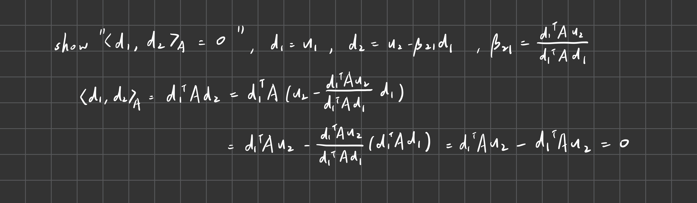

# Homework5

### Problem1
We test it by computing the error between the inverse we implemented against matlab's inverse, and the residual between $A(A^{-1})$ and $I$.
```
Size       Error           Residual        Status    
--------------------------------------------------
39         1.08e-17        1.00e-15        PASS      
42         1.05e-17        6.69e-16        PASS      
23         1.53e-17        4.51e-16        PASS      
5          4.42e-17        2.66e-16        PASS      
18         2.86e-17        4.57e-16        PASS      
49         1.10e-17        8.90e-16        PASS      
10         1.73e-17        3.00e-16        PASS      
92         3.51e-18        1.33e-15        PASS      
62         1.44e-17        6.72e-16        PASS      
38         1.40e-17        4.48e-16        PASS      
21         8.68e-18        3.38e-16        PASS      
54         1.74e-17        7.80e-16        PASS      
65         3.77e-18        8.90e-16        PASS      
43         1.40e-17        6.68e-16        PASS      
16         2.98e-17        4.72e-16        PASS      
77         3.60e-18        1.33e-15        PASS      
97         3.54e-18        1.11e-15        PASS      
2          1.11e-16        3.14e-16        PASS      
29         2.13e-17        6.69e-16        PASS      
100        3.52e-18        8.92e-16        PASS      
83         3.60e-18        1.11e-15        PASS      
58         1.77e-17        8.92e-16        PASS      
30         2.13e-17        4.48e-16        PASS      
77         5.24e-18        1.11e-15        PASS      
4          2.97e-17        2.26e-16        PASS      
39         1.41e-17        6.74e-16        PASS      
46         1.07e-17        1.11e-15        PASS      
28         1.45e-17        6.71e-16        PASS      
80         3.57e-18        8.93e-16        PASS      
16         3.18e-17        4.79e-16        PASS      
91         3.53e-18        8.95e-16        PASS      
27         2.14e-17        2.60e-16        PASS      
24         2.13e-17        4.73e-16        PASS      
16         1.67e-17        3.47e-16        PASS      
43         1.06e-17        5.57e-16        PASS      
19         1.48e-17        4.47e-16        PASS      
71         2.20e-18        8.90e-16        PASS      
71         3.63e-18        1.33e-15        PASS      
31         1.51e-17        4.49e-16        PASS      
19         1.47e-17        2.56e-16        PASS      
88         3.56e-18        1.33e-15        PASS      
83         3.53e-18        1.00e-15        PASS      
55         1.08e-17        8.90e-16        PASS      
89         3.52e-18        1.11e-15        PASS      
20         1.40e-17        4.56e-16        PASS      
76         3.67e-18        8.94e-16        PASS      
37         1.40e-17        4.63e-16        PASS      
48         2.09e-17        6.72e-16        PASS      
86         3.59e-18        8.89e-16        PASS      
84         3.53e-18        1.11e-15        PASS      
67         3.66e-18        8.92e-16        PASS      
32         2.12e-17        6.72e-16        PASS      
44         1.09e-17        6.69e-16        PASS      
82         3.54e-18        1.11e-15        PASS      
85         3.52e-18        1.11e-15        PASS      
82         2.18e-18        8.90e-16        PASS      
40         1.75e-17        7.80e-16        PASS      
97         3.61e-18        8.96e-16        PASS      
97         3.52e-18        1.11e-15        PASS      
48         1.09e-17        6.79e-16        PASS      
32         1.55e-17        6.70e-16        PASS      
45         2.09e-17        5.66e-16        PASS      
25         2.17e-17        6.72e-16        PASS      
46         1.06e-17        7.79e-16        PASS      
87         3.53e-18        8.97e-16        PASS      
83         2.20e-18        1.33e-15        PASS      
3          3.10e-17        1.27e-16        PASS      
60         1.44e-17        1.78e-15        PASS      
47         1.08e-17        6.68e-16        PASS      
77         3.57e-18        8.91e-16        PASS      
72         3.61e-18        8.90e-16        PASS      
4          6.58e-17        1.92e-16        PASS      
63         1.39e-17        1.11e-15        PASS      
99         5.23e-18        1.44e-15        PASS      
99         3.51e-18        1.11e-15        PASS      
89         3.52e-18        1.00e-15        PASS      
63         2.09e-17        8.90e-16        PASS      
60         1.74e-17        8.89e-16        PASS      
94         3.54e-18        8.93e-16        PASS      
22         1.49e-17        3.70e-16        PASS      
23         1.48e-17        5.59e-16        PASS      
40         1.43e-17        6.68e-16        PASS      
57         1.74e-17        6.69e-16        PASS      
65         3.82e-18        7.81e-16        PASS      
50         1.10e-17        8.90e-16        PASS      
61         2.09e-17        8.90e-16        PASS      
73         3.66e-18        6.71e-16        PASS      
60         1.75e-17        7.80e-16        PASS      
19         2.10e-17        3.42e-16        PASS      
73         3.66e-18        1.22e-15        PASS      
68         3.67e-18        9.01e-16        PASS      
99         3.52e-18        1.33e-15        PASS      
20         2.82e-17        4.51e-16        PASS      
90         3.60e-18        1.67e-15        PASS      
87         3.52e-18        1.22e-15        PASS      
41         1.40e-17        6.68e-16        PASS      
30         2.11e-17        4.59e-16        PASS      
98         3.53e-18        8.95e-16        PASS      
27         1.56e-17        4.65e-16        PASS      
21         8.97e-18        3.38e-16        PASS   
```

### Problem2

```
aluminum (k=205.0):
max temperature: 2193.51 C

copper (k=413.0):
max temperature: 1088.79 C
```
The peak temperature of cooper is lower than aluminum because it has higher thermal conductivity such that heat flows away more efficiently.

### Problem3

We test it by computing the error defined as the maximum absolute value of off-diagonal elements of $D^\top AD$.
```
Size       Error           Status    
-----------------------------------
39         7.87e-10        PASS      
42         6.78e-10        PASS      
23         6.36e-10        PASS      
5          1.13e-12        PASS      
18         1.32e-10        PASS      
49         8.01e-10        PASS      
10         4.20e-12        PASS      
92         4.15e-08        PASS      
62         2.29e-09        PASS      
38         6.99e-10        PASS      
21         4.27e-11        PASS      
54         2.29e-09        PASS      
65         6.11e-09        PASS      
43         1.51e-09        PASS      
16         1.14e-11        PASS      
77         1.04e-08        PASS      
97         1.13e-08        PASS      
2          1.11e-16        PASS      
29         1.40e-10        PASS      
100        1.55e-08        PASS      
83         2.98e-08        PASS      
58         5.05e-09        PASS      
30         1.77e-10        PASS      
77         6.73e-09        PASS      
4          8.53e-14        PASS      
39         8.81e-10        PASS      
46         2.14e-09        PASS      
28         1.16e-10        PASS      
80         1.53e-08        PASS      
16         1.92e-11        PASS      
91         3.47e-08        PASS      
27         2.08e-10        PASS      
24         4.40e-11        PASS      
16         2.25e-11        PASS      
43         1.33e-09        PASS      
19         6.06e-11        PASS      
71         1.18e-08        PASS      
71         9.07e-09        PASS      
31         1.04e-10        PASS      
19         2.81e-11        PASS      
88         4.05e-08        PASS      
83         7.00e-09        PASS      
55         7.78e-09        PASS      
89         3.40e-08        PASS      
20         1.83e-11        PASS      
76         3.12e-09        PASS      
37         1.51e-09        PASS      
48         1.44e-09        PASS      
86         2.12e-08        PASS      
84         1.09e-08        PASS      
67         4.87e-09        PASS      
32         4.50e-10        PASS      
44         8.62e-10        PASS      
82         1.01e-08        PASS      
85         6.57e-09        PASS      
82         7.10e-09        PASS      
40         1.32e-09        PASS      
97         1.31e-08        PASS      
97         3.24e-08        PASS      
48         1.94e-09        PASS      
32         6.48e-10        PASS      
45         2.98e-09        PASS      
25         9.45e-11        PASS      
46         1.43e-09        PASS      
87         2.50e-08        PASS      
83         1.79e-08        PASS      
3          3.55e-14        PASS      
60         7.20e-09        PASS      
47         1.01e-09        PASS      
77         3.13e-08        PASS      
72         4.54e-09        PASS      
4          1.46e-13        PASS      
63         4.38e-09        PASS      
99         1.92e-08        PASS      
99         1.26e-08        PASS      
89         4.69e-08        PASS      
63         3.42e-09        PASS      
60         3.60e-09        PASS      
94         2.14e-08        PASS      
22         2.11e-10        PASS      
23         4.55e-11        PASS      
40         7.82e-10        PASS      
57         7.98e-09        PASS      
65         7.64e-09        PASS      
50         2.22e-09        PASS      
61         6.17e-09        PASS      
73         2.15e-08        PASS      
60         2.41e-09        PASS      
19         5.65e-11        PASS      
73         5.87e-09        PASS      
68         3.23e-09        PASS      
99         3.45e-08        PASS      
20         1.67e-10        PASS      
90         5.03e-08        PASS      
87         2.57e-08        PASS      
41         8.03e-10        PASS      
30         5.48e-10        PASS      
98         2.16e-08        PASS      
27         3.43e-10        PASS      
21         2.63e-10        PASS      
```