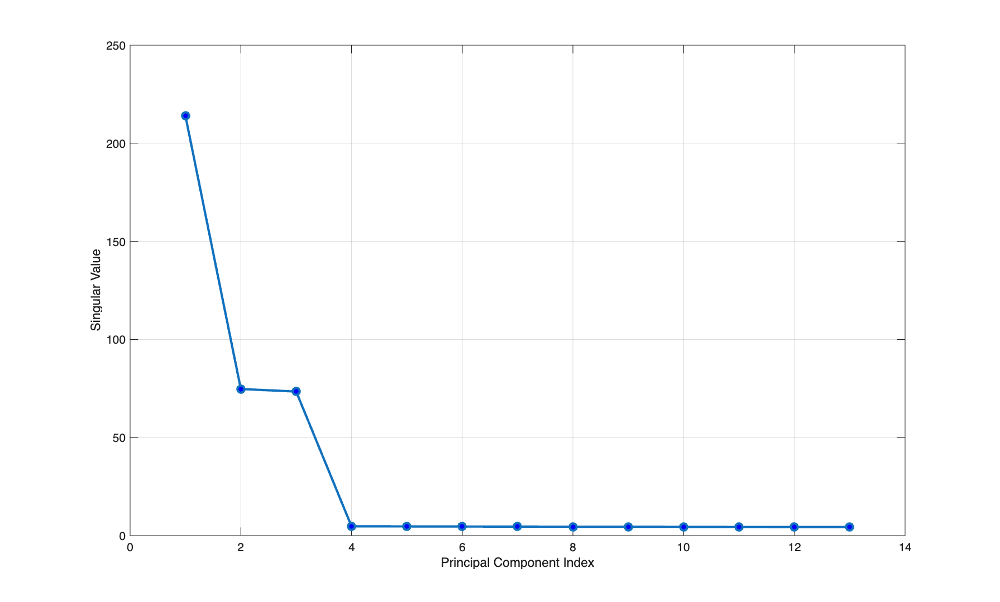
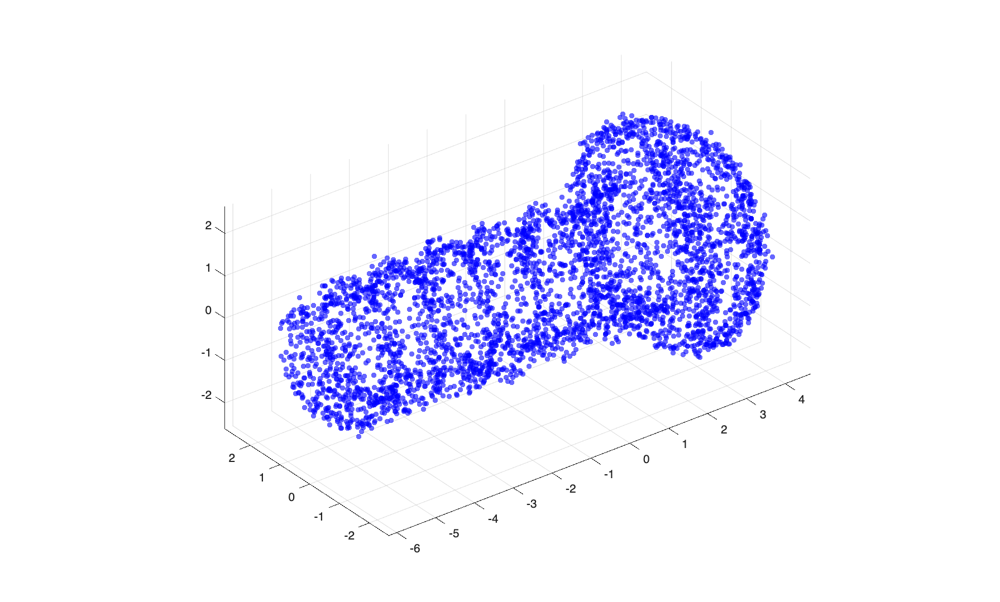

# Homework6

### Problem1


We test it by computing the orthogonality error $Q^\top Q-I$ and zero-element residual $|B_{ij}|$.
```
Size       Orth Err        Zero Res        Status    
-------------------------------------------------------
39         2.28e-16        6.15e-17        PASS      
91         2.22e-16        1.74e-16        PASS      
76         1.12e-16        8.29e-17        PASS      
88         7.01e-18        3.76e-16        PASS      
34         2.24e-16        3.38e-16        PASS      
64         2.69e-17        2.93e-16        PASS      
2          2.22e-16        1.11e-16        PASS      
43         2.29e-16        2.31e-16        PASS      
81         2.22e-16        2.06e-17        PASS      
3          1.11e-16        5.00e-16        PASS      
34         1.13e-16        4.54e-16        PASS      
93         2.31e-16        2.52e-17        PASS      
92         2.29e-16        4.72e-16        PASS      
33         1.38e-17        7.02e-18        PASS      
81         7.22e-18        8.39e-16        PASS      
12         6.39e-18        4.02e-16        PASS      
7          2.22e-16        2.63e-15        PASS      
28         8.15e-18        1.02e-16        PASS      
54         1.32e-17        3.46e-17        PASS      
17         2.45e-16        3.31e-16        PASS      
81         1.15e-16        2.33e-16        PASS      
97         1.00e-17        4.45e-17        PASS      
37         3.09e-19        6.48e-17        PASS      
86         2.28e-16        1.71e-16        PASS      
77         1.34e-17        2.93e-16        PASS      
10         2.33e-16        9.22e-17        PASS      
14         2.40e-16        3.26e-16        PASS      
29         1.47e-17        5.94e-16        PASS      
87         1.98e-17        9.37e-17        PASS      
47         2.34e-16        8.47e-16        PASS      
2          0.00e+00        4.44e-16        PASS      
70         1.22e-16        4.42e-16        PASS      
6          1.11e-16        6.39e-16        PASS      
17         2.78e-18        3.92e-17        PASS      
46         1.13e-16        9.83e-17        PASS      
98         1.25e-16        2.82e-16        PASS      
62         1.37e-16        2.54e-16        PASS      
75         2.25e-16        1.83e-15        PASS      
48         2.22e-16        1.85e-15        PASS      
15         2.26e-16        5.14e-16        PASS      
65         2.46e-16        9.78e-17        PASS      
45         1.38e-16        1.80e-16        PASS      
71         2.43e-16        6.67e-17        PASS      
46         2.20e-17        2.01e-16        PASS      
95         2.42e-17        2.43e-16        PASS      
13         2.37e-16        8.43e-17        PASS      
75         1.42e-17        1.58e-16        PASS      
21         2.26e-16        1.82e-16        PASS      
22         1.23e-16        1.28e-16        PASS      
64         2.22e-16        3.48e-17        PASS      
82         2.22e-16        3.06e-16        PASS      
83         2.25e-16        5.42e-15        PASS      
22         1.27e-17        2.98e-16        PASS      
4          0.00e+00        2.22e-16        PASS      
37         1.65e-18        8.80e-17        PASS      
43         1.13e-16        1.11e-17        PASS      
81         2.27e-16        8.29e-16        PASS      
28         2.24e-16        7.66e-16        PASS      
91         7.88e-18        1.51e-16        PASS      
60         2.46e-17        5.94e-16        PASS      
14         3.74e-18        2.41e-17        PASS      
36         2.25e-16        1.66e-16        PASS      
45         2.24e-16        4.00e-17        PASS      
47         1.10e-17        4.32e-17        PASS      
28         1.18e-16        2.05e-16        PASS      
85         2.39e-17        1.65e-16        PASS      
20         6.46e-18        7.55e-16        PASS      
46         2.23e-17        5.24e-17        PASS      
26         7.12e-18        2.01e-16        PASS      
52         1.35e-17        2.95e-16        PASS      
33         1.19e-16        3.83e-16        PASS      
65         1.15e-16        3.99e-16        PASS      
31         2.24e-16        5.43e-17        PASS      
69         1.12e-16        1.06e-16        PASS      
9          0.00e+00        4.95e-16        PASS      
76         1.93e-17        1.86e-16        PASS      
69         1.12e-16        1.35e-15        PASS      
77         1.21e-16        7.76e-16        PASS      
70         1.03e-17        4.76e-16        PASS      
40         2.07e-17        8.87e-17        PASS      
2          2.22e-16        4.44e-16        PASS      
59         2.45e-16        1.71e-17        PASS      
91         1.15e-16        1.91e-16        PASS      
68         2.24e-16        6.40e-18        PASS      
18         2.41e-16        1.22e-16        PASS      
47         8.77e-18        1.07e-16        PASS      
97         2.22e-16        5.90e-16        PASS      
15         6.87e-18        3.50e-16        PASS      
42         1.30e-17        4.94e-17        PASS      
77         1.81e-17        3.47e-16        PASS      
53         1.19e-16        2.95e-18        PASS      
30         2.24e-16        3.78e-16        PASS      
54         1.26e-16        1.79e-16        PASS      
14         2.24e-16        1.05e-15        PASS      
18         2.22e-16        4.88e-17        PASS      
70         1.12e-16        3.08e-16        PASS      
20         4.60e-16        1.55e-16        PASS      
92         2.06e-17        6.55e-18        PASS      
53         2.46e-16        2.50e-17        PASS      
7          0.00e+00        1.71e-15        PASS    
```

### Problem2
We test it by computing the error between the eigenvalues we computed and the eigenvalues by Matlab. In addition, we set the maximum size to $N=20$ because the Jacobi method does not scale well.
```
Size       Error           Status    
-----------------------------------
9          4.97e-11        PASS      
8          1.87e-11        PASS      
7          7.06e-12        PASS      
4          3.62e-15        PASS      
14         2.35e-11        PASS      
8          6.81e-12        PASS      
15         7.90e-11        PASS      
19         1.27e-10        PASS      
20         9.16e-11        PASS      
11         1.17e-10        PASS      
4          2.63e-12        PASS      
19         1.08e-10        PASS      
19         4.82e-11        PASS      
17         4.31e-11        PASS      
18         6.39e-11        PASS      
9          2.51e-11        PASS      
4          3.36e-13        PASS      
7          4.33e-11        PASS      
14         7.05e-11        PASS      
13         8.99e-11        PASS      
4          2.01e-15        PASS      
11         3.55e-11        PASS      
17         5.14e-11        PASS      
17         1.94e-10        PASS      
6          2.51e-11        PASS      
12         3.77e-11        PASS      
5          1.72e-13        PASS      
17         9.34e-11        PASS      
8          1.79e-11        PASS      
19         1.31e-10        PASS      
4          5.85e-12        PASS      
12         1.34e-10        PASS      
18         7.89e-11        PASS      
5          2.15e-12        PASS      
15         6.91e-11        PASS      
3          9.29e-12        PASS      
11         1.03e-11        PASS      
20         7.91e-11        PASS      
9          1.50e-11        PASS      
7          9.65e-13        PASS      
9          8.16e-11        PASS      
11         4.46e-11        PASS      
4          1.10e-11        PASS      
11         7.03e-11        PASS      
12         1.16e-10        PASS      
10         4.11e-11        PASS      
9          2.78e-11        PASS      
8          1.50e-12        PASS      
6          4.99e-12        PASS      
18         4.32e-11        PASS      
19         1.43e-10        PASS      
9          1.34e-11        PASS      
15         5.96e-11        PASS      
15         1.12e-10        PASS      
16         6.39e-11        PASS      
3          2.81e-13        PASS      
4          8.66e-13        PASS      
7          5.27e-11        PASS      
8          2.26e-11        PASS      
5          4.88e-11        PASS      
12         8.99e-11        PASS      
16         8.86e-11        PASS      
20         1.26e-10        PASS      
13         9.72e-11        PASS      
12         2.06e-11        PASS      
4          3.36e-14        PASS      
17         1.35e-10        PASS      
14         7.65e-11        PASS      
4          1.88e-15        PASS      
10         3.49e-11        PASS      
15         2.70e-11        PASS      
8          4.05e-11        PASS      
4          3.82e-12        PASS      
11         2.99e-10        PASS      
16         9.17e-11        PASS      
4          4.79e-11        PASS      
10         4.39e-11        PASS      
18         3.07e-10        PASS      
14         1.21e-11        PASS      
20         1.03e-10        PASS      
16         6.78e-11        PASS      
18         9.50e-11        PASS      
7          2.19e-12        PASS      
16         1.80e-10        PASS      
7          6.23e-12        PASS      
12         5.59e-11        PASS      
19         7.36e-11        PASS      
11         1.62e-10        PASS      
18         9.33e-11        PASS      
18         8.15e-11        PASS      
6          3.27e-11        PASS      
9          2.31e-12        PASS      
7          2.29e-11        PASS      
3          3.09e-15        PASS      
13         1.30e-10        PASS      
11         9.32e-11        PASS      
4          2.15e-11        PASS      
11         3.14e-11        PASS      
12         5.51e-11        PASS      
16         2.44e-11        PASS 
```

### Problem3
We plot out the PCA results.


Only 3 dimensions are useful and the remaining 10 dimensions are noise. We plot the 3D plot.


This is probably a mushroom (?)