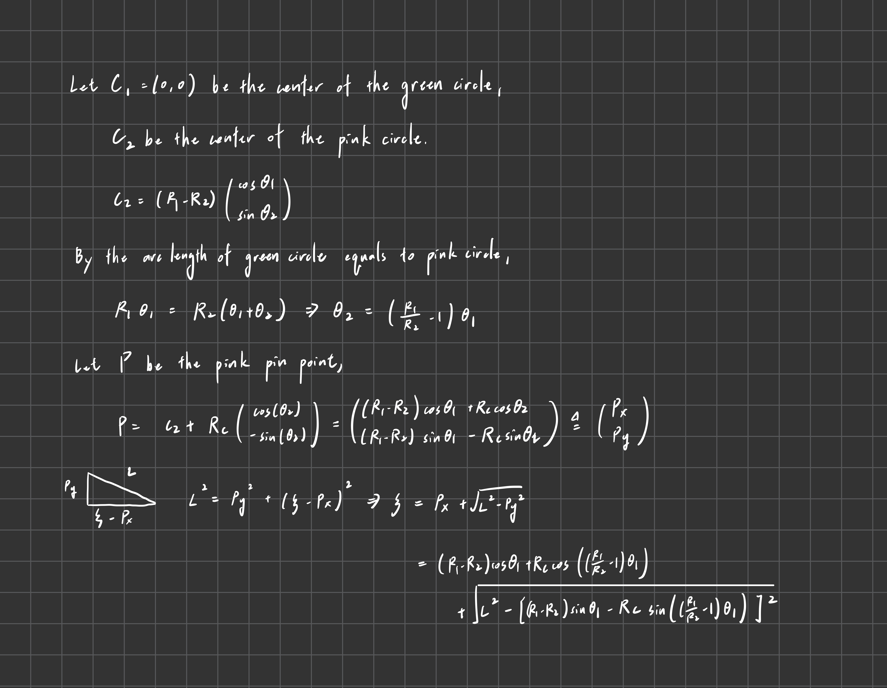
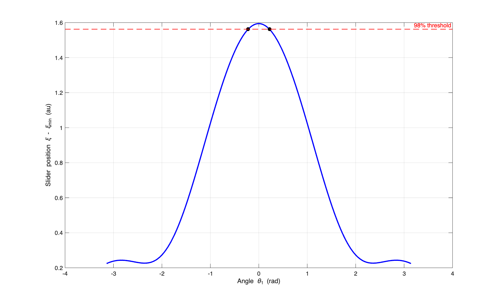
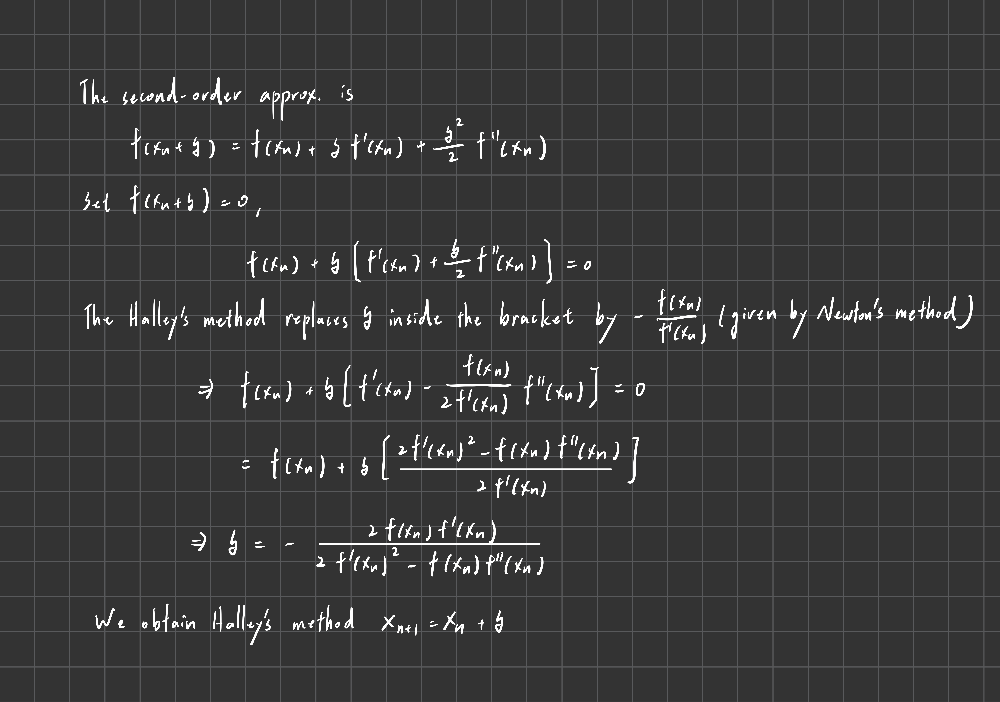
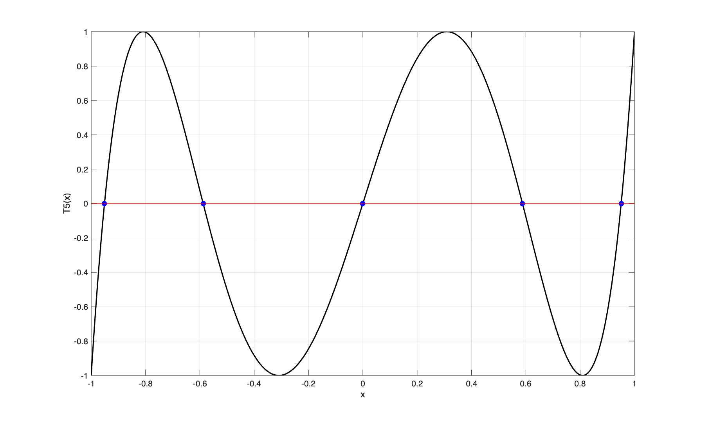
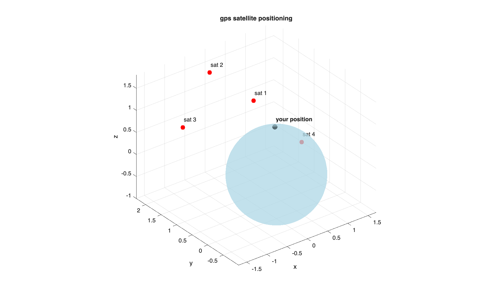

# Homework8

### Problem1


```
max displacement: 2.298400
min displacement: 0.704262
dwell threshold:  2.266517

left root:   -0.219221 rad
right root:  0.219221 rad
dwell width: 0.438441 rad (25.12 degrees)

sanity check f(th_left)  = 0.000000e+00
sanity check f(th_right) = 0.000000e+00
```



### Problem2

```
root  computed   true       error     
----------------------------------------
1     0.951057   0.951057   1.11e-16  
2     0.587785   0.587785   0.00e+00  
3     0.000000   0.000000   6.12e-17  
4     -0.587785  -0.587785  1.11e-16  
5     -0.951057  -0.951057  0.00e+00  
```



### Problem3
```
computed position (x, y, z): 0.4472, 0.6325, 0.6325
computed local time:         50.0000
distance from earth center:  1.000004 (should be approx 1.0)
```
Illustration of the result:
