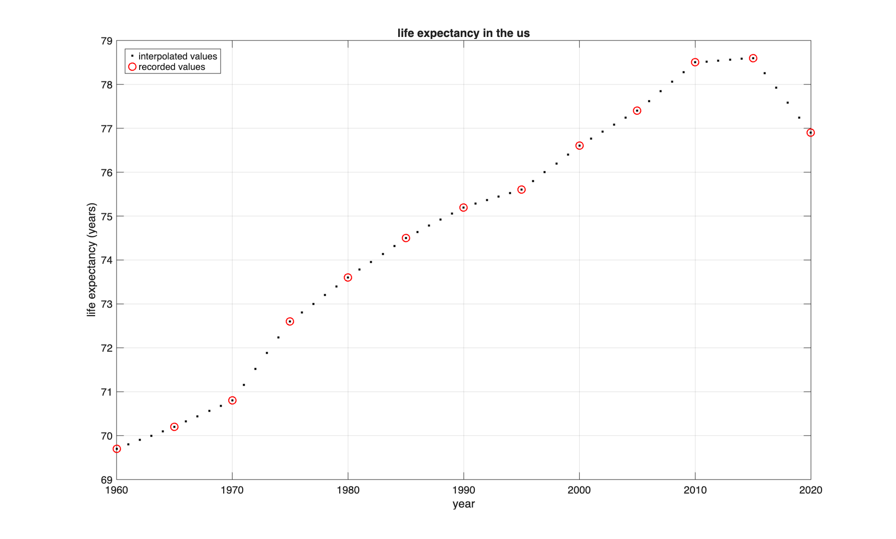
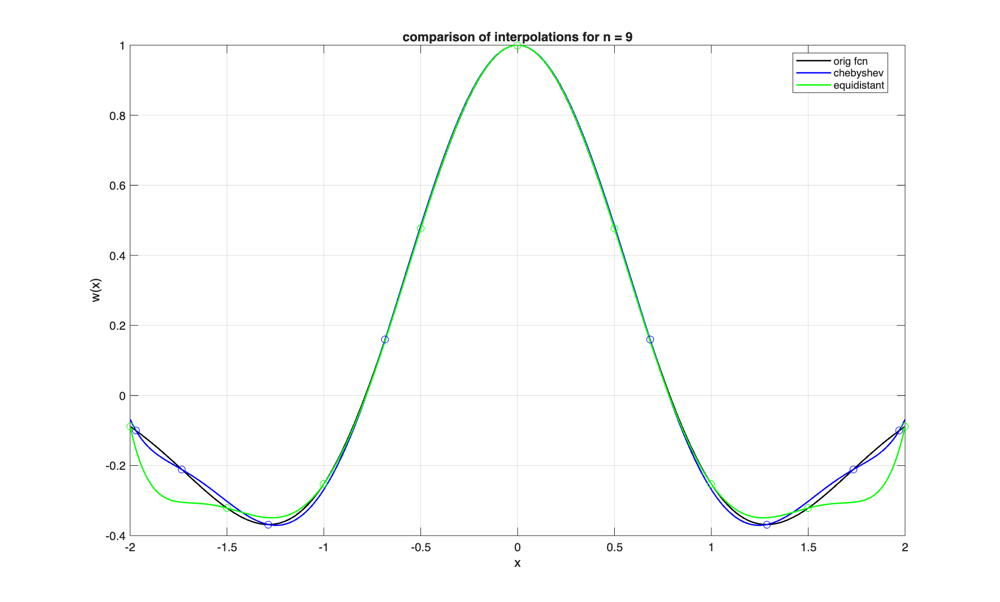
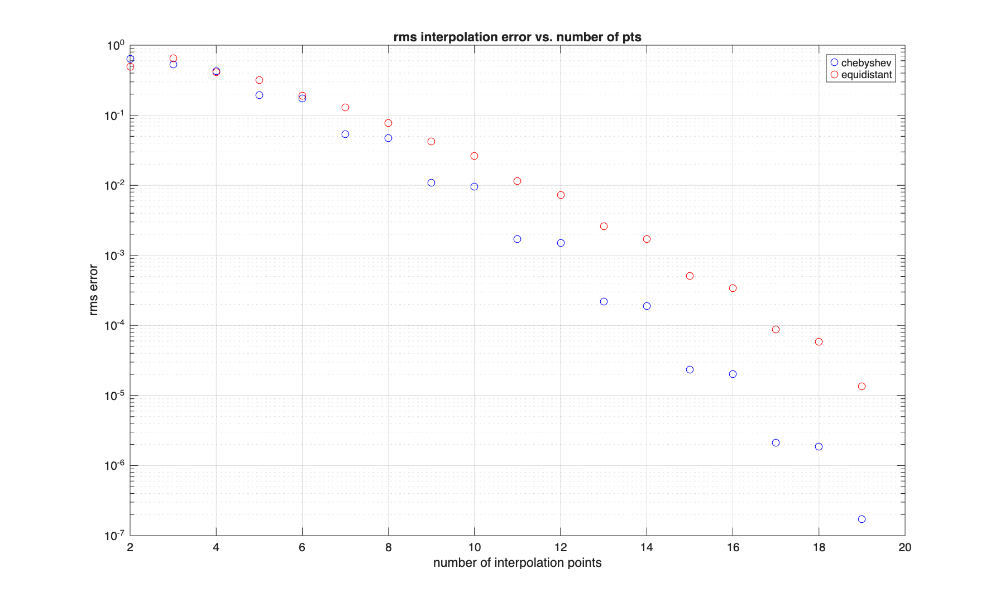
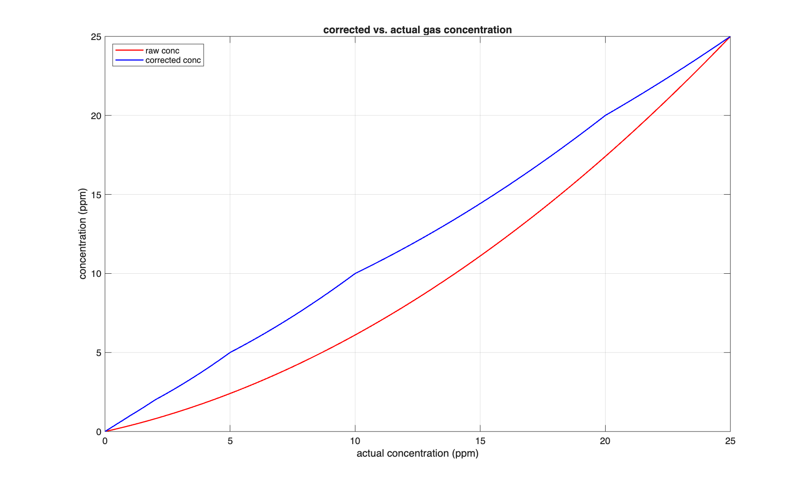

# Homework9

### Problem1
```
estimated life expectancy in 1997: 76.00 years
```


### Problem2



### Problem3
We integrated `analyzer_corrector.m` into `src/problem3.m` and `analyzer_volt_to_raw_conc.m` into `test/test_problem3.m`.

```
max deviation after correction: 0.5741 ppm
status: pass (within 5% specification)
```