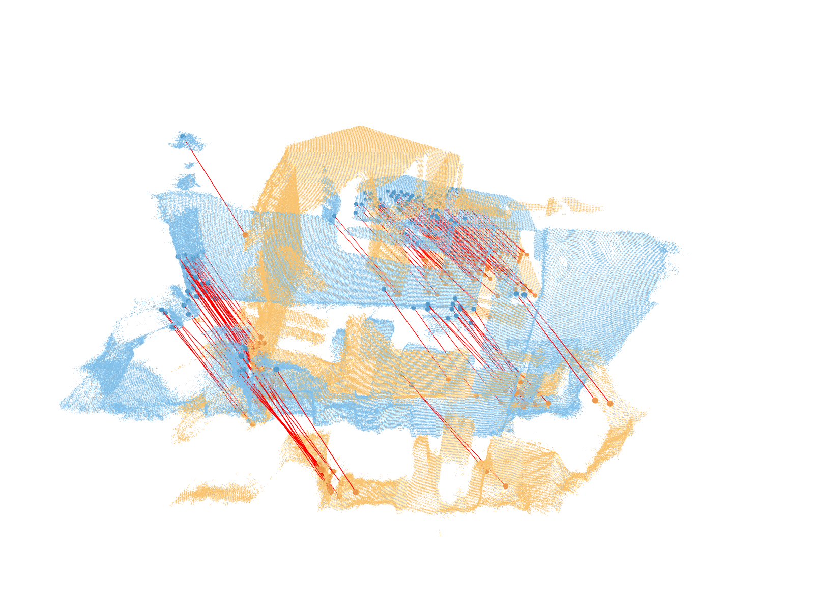

# Numerical Analysis Project

Python implementation of Horn's method for solving point cloud registration.

> B. K.P. Horn. Closed-Form Solution of Absolute Orientation Using Unit Quaternions. *Journal of the Optical Society A,* 4:629–642, 04 1987.

|  |  |
| -------------------------------- | ----------------------------- |


### :gear: Set-up
```
conda create -n numerical-analysis-project python=3.11 -y
conda activate numerical-analysis-project
pip install -r requirements.txt
```
> open3d supports python <= 3.11

### :checkered_flag: Run
```
main.py
```