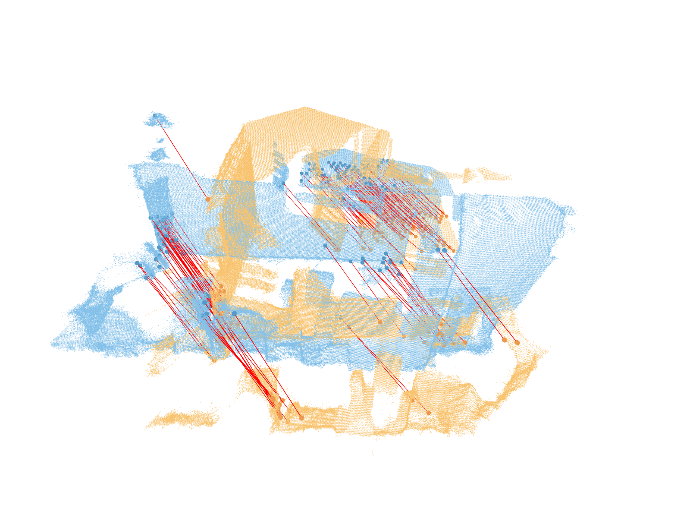
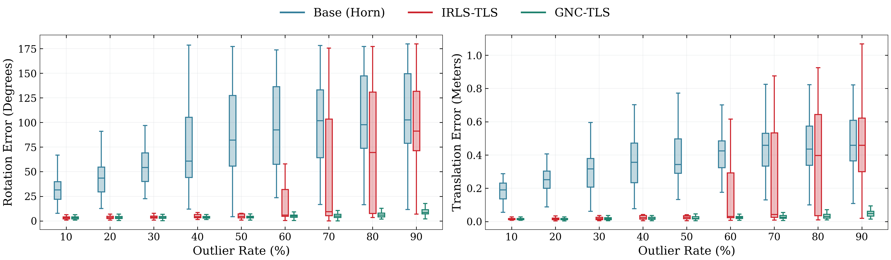

# Numerical Analysis Project

Python implementation of robust point cloud registration. Baseline registration uses Horn's method, and we implemented Iterative Reweighted Least Squares and Graduated Non-Convexity.

|  |  |
| -------------------------------- | ----------------------------- |


### :gear: Set-up
```
conda create -n numerical-analysis-project python=3.11 -y
conda activate numerical-analysis-project
pip install -r requirements.txt
```
> open3d supports python <= 3.11

### :checkered_flag: Run
```
main.py
```

